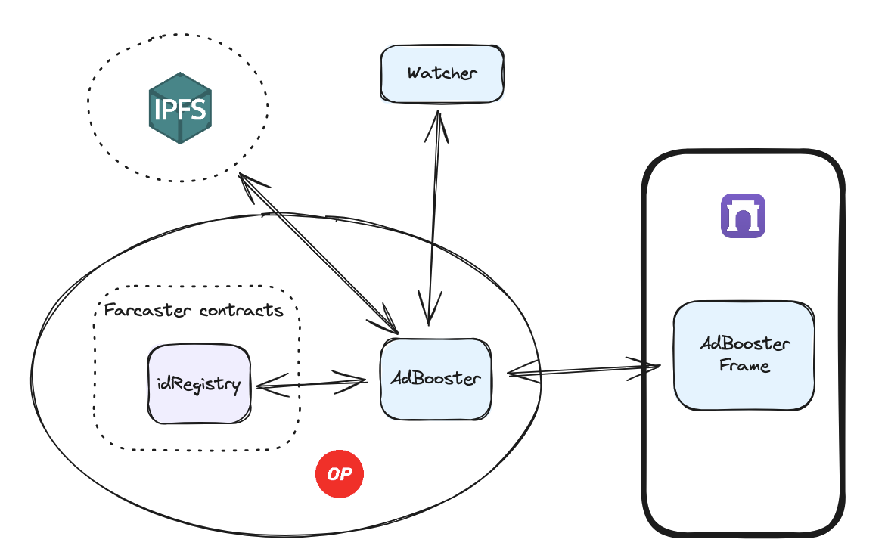

# 🚀 AdBooster

AdBooster is a new tool designed to tackle visibility challenges on decentralized social media platforms like Farcaster. While platforms such as Farcaster have grown popular for their innovative features, such as "frames" that allow users to interact with multiple applications seamlessly, many still struggle to gain visibility due to challenges like reaching larger audiences, feed algorithm issues, and a lack of promotional tools.

Enter AdBooster: a decentralized advertising space where users can sell digital AD slots directly to those looking to boost their content. This platform allows content creators and influencers to monetize their reach by offering their digital space for ads. For advertisers, especially smaller ones or individual creators, it means easier access to valuable AD opportunities without the usual barriers. AdBooster creates a new marketplace where users bid for AD slots, offering flexibility in how and when promotions are displayed. This not only helps advertisers target their efforts more effectively but also opens up a new way to leverage digital space for promotion in the decentralized web.

&nbsp;

***

&nbsp;

## Architecture

&nbsp;

***

&nbsp;

## How it works
* Once the user has created the AdBooster frame, he must call `putAdSlotsOnSale`, providing the AdBooster contract with the signed Farcaster message that proves the user has indeed created the Frame.
* If the message is valid, then AdBooster will enable the purchase of slots belonging to the newly registered Frame.
* From this moment, users can buy slots for the Frame by calling `buyAdSlot`.
* For each slot, an auction starts. The one who pays the most gets the slot.
* The user who earned fees by selling their digital spaces can claim these fees by calling `claimRewardsByAdSlots`.